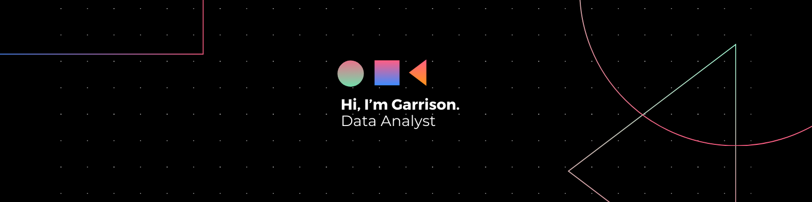

<!-- Add Google Fonts link -->
<link href="https://fonts.googleapis.com/css2?family=JetBrains+Mono:wght@400;700&display=swap" rel="stylesheet">

<!-- Banner -->

<!-- Main Data Stack List -->
<h3 align="left" style = "margin-bottom: -10px; font-family: 'JetBrains Mono';">🛠️ Data Technology Stack</h3>

  

     Python
  

  

     NumPy
  

  

     Pandas
  

  

     SciKit Learn
  

  

     MySQL
  

  

     SQL Server
  

  

     PostgreSQL
  

  

     Excel
  

  

     Power BI
  

  

     Tableau
  

  

     Figma
  

 

<h3 align="left" style = "margin-bottom: -10px; font-family: 'JetBrains Mono';">🛠️ Softwares</h3>

  

     VS Code
  

  

     Visual Studio
  

  

     PyCharm
  

  

     Github
  

  

     Azure
  

  

     Git
  

  

     Jupyter
  

  

     PowerApps
  

 

 

<h3 align="left">🛠️GitHub Activity Graph:</h3>

<table>
    <tr>
        <td align="center"></td>
        <td rowspan="2" align="center"></td>
    </tr>
    <tr>
        <td align="center"></td>
    </tr>
    <tr>
        <td colspan="2" align="center"></td>
    </tr>
</table>